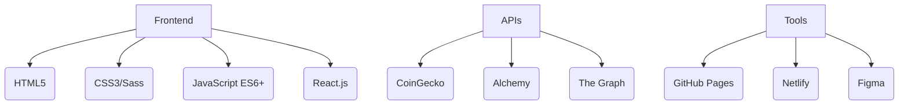

# 🌌 CriptoEduAr: Desentraña los Secretos del Universo Cripto 🚀

  
*(Recomendación: Crea un banner profesional en Canva con elementos cripto y colores morados/azules)*

---

## 🔮 ¿Qué es CriptoEduAr?

**Más que una plataforma educativa, es tu nave espacial al mundo Web3.**  
Domina los conceptos esenciales con:
- 🧱 **Blockchain**: Desde proof-of-work hasta zk-SNARKs
- ₿ **Bitcoin**: La revolución monetaria descentralizada
- Ξ **Ethereum**: Smart contracts y el futuro de las DApps
- 🖼️ **NFTs**: Más allá del arte digital
- 🏦 **DeFi**: El sistema financiero del mañana

---

## ✨ Características Únicas

| Sección | Descripción | Tecnología |
|---------|-------------|------------|
| **Simulador Trading** | Practica sin riesgo con datos históricos | Chart.js + CoinGecko API |
| **Roadmap Visual** | Aprende progresivamente con rutas de aprendizaje | Mermaid.js |
| **Zona de Pruebas** | Interactúa con contratos inteligentes de testnet | Web3.js |
| **CriptoQuizz** | Pon a prueba tus conocimientos | JavaScript |

---

## 🛠️ Stack Tecnológico



---

## 🎯 Roadmap 2024

- ✅ **Fase 1**: Base educativa (Q1)
- 🚧 **Fase 2**: Simulador DeFi (Q2)
- ⏳ **Fase 3**: Certificados NFT (Q3)
- 🔮 **Fase 4**: DAO Educativa (Q4)

---

## 🌍 Comunidad Web3

Únete a nuestra constelación:
- [](https://discord.gg/tu-invitacion)
- [](https://t.me/criptoeduar)
- [](https://twitter.com/CriptoEduAr)

---

## 🚀 Cómo Contribuir

1. Haz fork del repositorio
2. Crea tu feature branch:
```bash
git checkout -b feature/tu-mejora
```
3. Implementa tus cambios
4. Abre un PR con:
- Descripción detallada
- Capturas de pantalla
- Tests relevantes

---

## 📜 Licencia

```text
MIT License
Copyright (c) 2024 CriptoEduAr
```

---

## 🔗 Enlaces Esenciales

[](https://ariasalejo.github.io/Cryptoeduar)
[](https://docs.criptoeduar.ar)

---

> "La educación es el pasaporte al futuro, y blockchain es el vehículo que nos llevará allí."  
> *- Satoshi Nakamoto (probablemente)*

---

✨ **Tip Pro**: Usa [Shields.io](https://shields.io/) para crear badges personalizados que muestren métricas en tiempo real (usuarios activos, última actualización, etc.).
